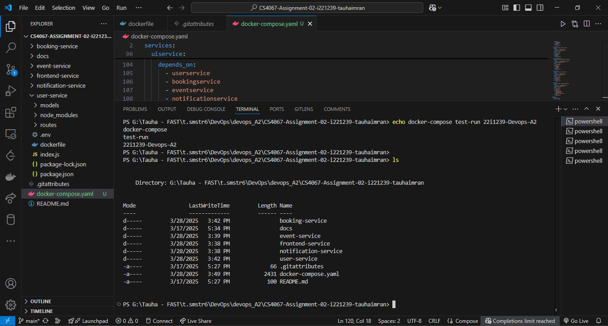
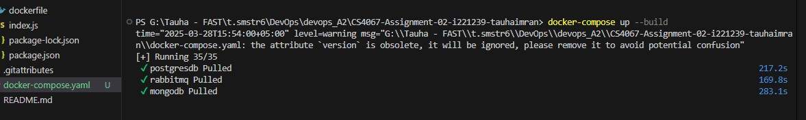
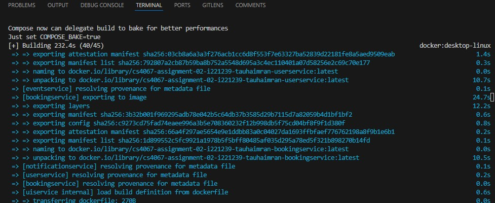
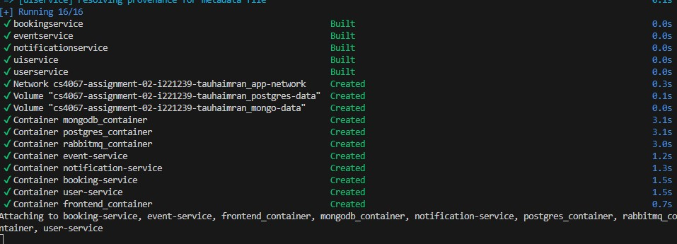
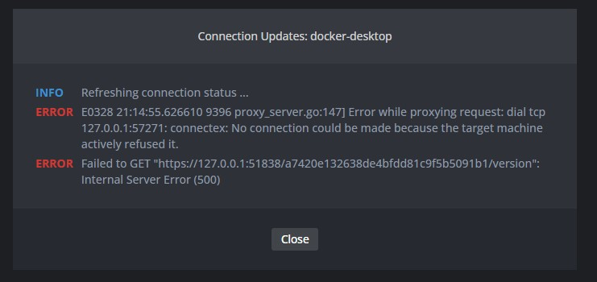
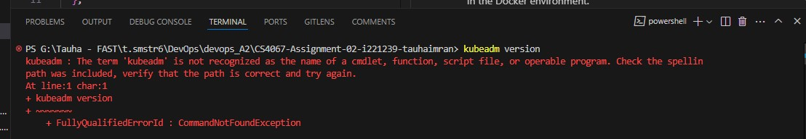
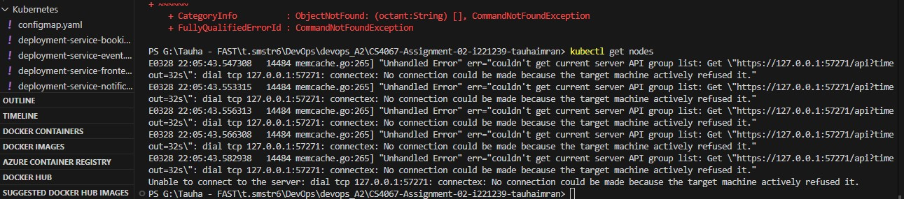
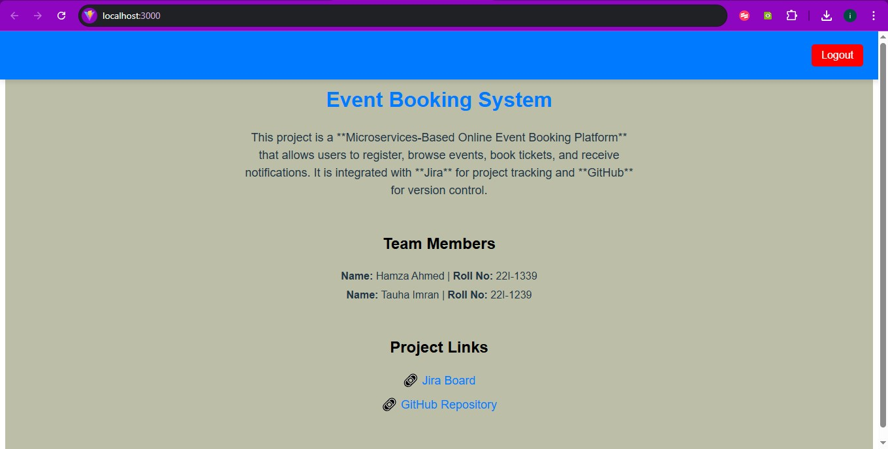

# CS4067-Assignment-02-i221239-tauhaimran
 ## Containerization & Deployment
 
 **Name:** Tauha Imran  
**Roll Number:** i221239  
 
 DevOps A2 - containerizing A1 with Docker and Kubernetes
 Online Event Booking Platform

---

## Project Structure

```
/CS4067-EventBooking
├── /user-service-codebase
│ └── Dockerfile
├── /event-service-codebase
│ └── Dockerfile
├── /booking-service-codebase
│ └── Dockerfile
├── /notification-service-codebase
│ └── Dockerfile
├── /frontend-service-codebase
│ └── Dockerfile
└── /kubernetes
├── namespace.yaml
├── configmap.yaml
├── secrets.yaml
├── deployment-service-user.yaml
├── deployment-service-event.yaml
├── deployment-service-booking.yaml
├── deployment-service-notification.yaml
├── deployment-service-frontend.yaml
├── ingress.yaml
└── docker-compose.yml
```
---

### Docker Compose (Working Implementation)
1. Clone the repository
2. Run: `docker-compose up --build`
3. Access frontend at: `http://localhost:3000`

### Kubernetes (Non-functional)
1. Ensure Kubernetes cluster is running
2. Apply configurations: `kubectl apply -f kubernetes/`
3. Note: This implementation currently fails due to cluster configuration issues

## Known Issues

1. Kubernetes deployment fails with:
   - Image pull errors
   - Pods in CrashLoopBackOff state
   - Ingress routing not functioning

2. Attempted solutions that didn't work:
   - Different Kubernetes environments (Docker Desktop, kubeadm)
   - Lens Kubernetes IDE debugging
   - Various image pull policies

## Verification

The application has been verified to work correctly using Docker Compose. All microservices communicate as expected in the Docker environment.

## Screenshots
_Docker Compose Running_






_Kubernetes Errors_




_working frontend_
